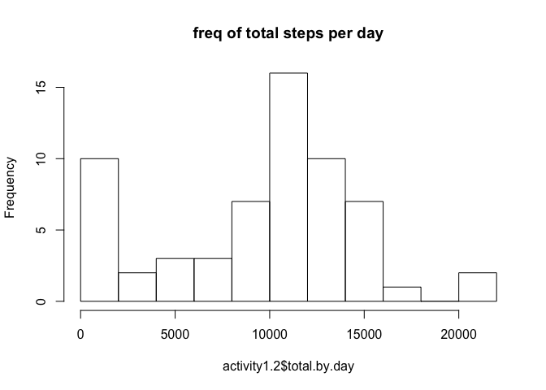
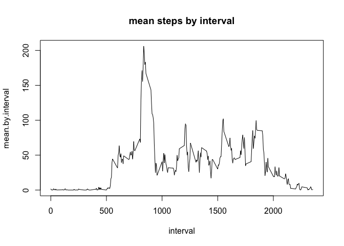
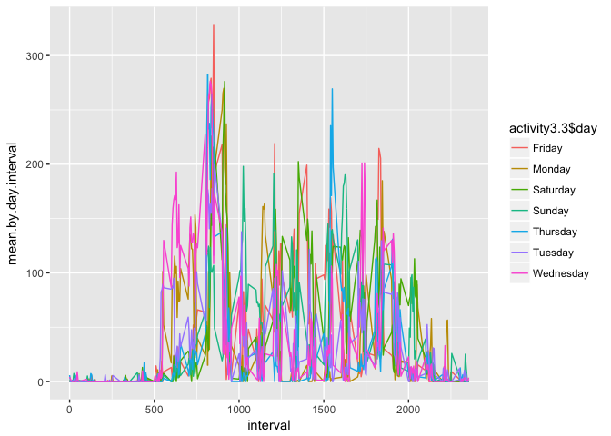
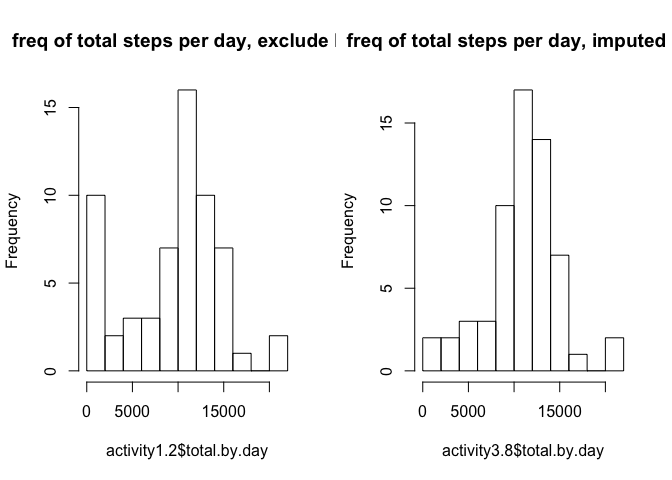
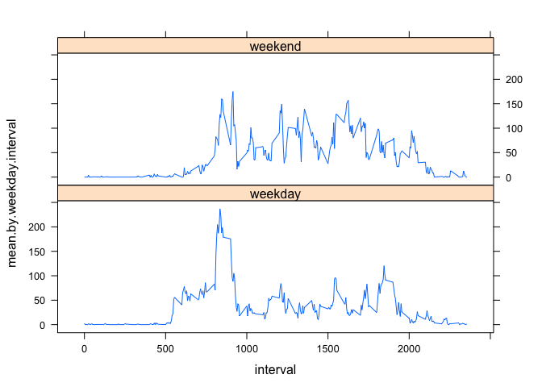

# PA1_template

This document presents the analysis for the Course 5, Week 2 coding assignment.

## Set up of the environment


```r
 setwd("/Users/nikolaydobrinov/Documents/work/Courses/R/WorkDirectory/Course5_week2_coding_assignment")
library(dplyr)
```

```
## 
## Attaching package: 'dplyr'
```

```
## The following objects are masked from 'package:stats':
## 
##     filter, lag
```

```
## The following objects are masked from 'package:base':
## 
##     intersect, setdiff, setequal, union
```

```r
library(lattice)
library(ggplot2)
```

## Loading data and taking a quick look

```r
 activity <- read.csv("./Data/activity.csv")
 dim(activity)
```

```
## [1] 17568     3
```

```r
 head(activity)
```

```
##   steps       date interval
## 1    NA 2012-10-01        0
## 2    NA 2012-10-01        5
## 3    NA 2012-10-01       10
## 4    NA 2012-10-01       15
## 5    NA 2012-10-01       20
## 6    NA 2012-10-01       25
```

```r
 table(is.na(activity))
```

```
## 
## FALSE  TRUE 
## 50400  2304
```

## Task 1: What is mean total number of steps taken per day?
### Description: 
For this part of the assignment, you can ignore the missing values in the dataset.

1. Calculate the total number of steps taken per day
2. If you do not understand the difference between a histogram and a barplot, 
research the difference between them. Make a histogram of the total number of 
steps taken each day
3. Calculate and report the mean and median of the total number of steps taken per day

### Analysis:
First select only the needed variables, group by date and calculate totals by date

```r
activity1 <- select(activity, steps:date)
activity1.1 <- group_by(activity1,date) 
activity1.2 <- summarize(activity1.1,total.by.day=sum(steps, na.rm=T))
```
Create a histogram of total steps per day

```r
hist(activity1.2$total.by.day, breaks=10, main="freq of total steps per day")
```

<!-- -->

The mean of total number of steps taken per day is 9354.2295082 and the median of total number of steps taken per day is 10395.

```r
mean(activity1.2$total.by.day)
```

```
## [1] 9354.23
```

```r
median(activity1.2$total.by.day)
```

```
## [1] 10395
```

## Task 2: What is the average daily activity pattern?

### Description:

1. Make a time series plot (i.e. 𝚝𝚢𝚙𝚎 = "𝚕") of the 5-minute interval (x-axddis) an
and the average number of steps taken, averaged across all days (y-axis)
2. Which 5-minute interval, on average across all the days in the dataset, 
contains the maximum number of steps?

### Analysis:
First select only the needed variables, group by date and calculate means by interval


```r
activity2 <- select(activity, interval, steps)
activity2.1 <- group_by(activity2,interval) 
activity2.2 <- summarize(activity2.1,mean.by.interval=mean(steps, na.rm=T))
activity2.3 <- arrange(activity2.2,interval)
```

Create a time series plot of mean steps by interval across all days

```r
with(activity2.3,plot(interval,mean.by.interval, main="mean steps by interval", type="l"))
```

<!-- -->

The interval that contains the maximum mean of steps taken across all days is 835. Note that this 
formulation of the code checks if the maximum is repeated in more than one interval

```r
activity2.3[which(activity2.3[,2]==max(activity2.3[,2])), 1]
```

```
## # A tibble: 1 × 1
##   interval
##      <int>
## 1      835
```

## Task 3: Imputing missing values

### Description:
Note that there are a number of days/intervals where there are missing values 
(coded as 𝙽𝙰). The presence of missing days may introduce bias into some
 calculations or summaries of the data.

1. Calculate and report the total number of missing values in the dataset (i.e. the total number of rows with 𝙽𝙰s)
2. Devise a strategy for filling in all of the missing values in the dataset. 
 The strategy does not need to be sophisticated. For example, you could use 
 the mean/median for that day, or the mean for that 5-minute interval, etc.
3. Create a new dataset that is equal to the original dataset but with the missing data filled in.
4. Make a histogram of the total number of steps taken each day and Calculate 
 and report the mean and median total number of steps taken per day. Do these 
 values differ from the estimates from the first part of the assignment? What is 
 the impact of imputing missing data on the estimates of the total daily number of steps?

### Analysis:

We first count the number of rows with NA in each column of the original dataset

```r
sapply(activity, function(x) sum(is.na(x)))
```

```
##    steps     date interval 
##     2304        0        0
```

We impute missing steps by the average for interval by day of week, as it is likely 
 the steps pattern depends on the day of week. First format the dates as date and extract day of week

```r
activity$day <- weekdays(as.Date(activity$date))
```

Group the data by day of week and interval to take means of the intervals by day of week. First 
 select only the needed variables, then group by day of week and interval and 
 calculate the means within these groups
 
 ```r
 activity3 <- select(activity, day, interval, steps)
 activity3.1 <- group_by(activity3,day,interval) 
 activity3.2 <- summarize(activity3.1,mean.by.day.interval=mean(steps, na.rm=T))
 activity3.3 <- arrange(activity3.2,day,interval)
 ```
We quickly check if steps trends differ by day of week by plotting the time series 
of steps by interval and by day of week. 

```r
qplot(
        x = interval,
        y = mean.by.day.interval,
        data = activity3.3,
        color = activity3.3$day, 
        geom = "line"
)
```

<!-- -->

To impute the missing values we merge the original activity data set with the 
new activity3.3 dataset. Then we replace the NAs with the pre-calculated interval 
means by day of week. This results in the new data set "activity3.5".

```r
merge_activity3.4 <- merge(activity, activity3.3, by=c("day","interval"))
merge_activity3.4$steps.nonNA <- ifelse(is.na(merge_activity3.4$steps),
                                        merge_activity3.4$mean.by.day.interval,
                                        merge_activity3.4$steps)
activity3.5 <- select(merge_activity3.4,interval, date, steps.nonNA)
```

Create the updated plot and compare with the original data. See Task 1 for more detail.

```r
activity3.6 <- select(activity3.5, date, steps.nonNA)
activity3.7 <- group_by(activity3.6,date) 
activity3.8 <- summarize(activity3.7,total.by.day=sum(steps.nonNA, na.rm=T))

par(mfrow=c(1,2))
hist(activity1.2$total.by.day, breaks=10, main="freq of total steps per day, exclude NA")
hist(activity3.8$total.by.day, breaks=10, main="freq of total steps per day, imputed NA")
```

<!-- -->

The mean of total number of steps taken per day excluding NA is 9354.2295082, while
the mean of total number of steps taken per day imputing NA is 1.082121\times 10^{4}.
The median of total number of steps taken per day excluding NA is 10395, while
the median of total number of steps taken per day imputing NA is 1.1015\times 10^{4}.

Mean of total number of steps taken per day, exclude NA:

```r
mean(activity1.2$total.by.day)
```

```
## [1] 9354.23
```
Mean of total number of steps taken per day, impute NA:

```r
mean(activity3.8$total.by.day)
```

```
## [1] 10821.21
```
Median of total number of steps taken per day, exclude NA:

```r
median(activity1.2$total.by.day)
```

```
## [1] 10395
```
Median of total number of steps taken per day, impute NA:

```r
median(activity3.8$total.by.day)
```

```
## [1] 11015
```

## Task 4: Are there differences in activity patterns between weekdays and weekends?

### Description:

For this part the 𝚠𝚎𝚎𝚔𝚍𝚊𝚢𝚜() function may be of some help here. Use the dataset with the filled-in missing values for this part.

1. Create a new factor variable in the dataset with two levels – “weekday” and 
 “weekend” indicating whether a given date is a weekday or weekend day.
2. Make a panel plot containing a time series plot (i.e. 𝚝𝚢𝚙𝚎 = "𝚕") of the 5-minute 
 interval (x-axis) and the average number of steps taken, averaged across all 
 weekday days or weekend days (y-axis). See the README file in the GitHub repository 
 to see an example of what this plot should look like using simulated data.

### Analysis:

First, format the dates as date, extract day of week, and create the new required variable.

```r
activity4 <- activity3.5
activity4$day <- weekdays(as.Date(activity3.5$date))
activity4$weekday <- ifelse(activity4$day=="Saturday" | activity4$day=="Sunday",
                            "weekend",
                            "weekday")
```
Group the data by weekday and interval to take means of the intervals by weekday.
The resulting data set "activity4.3" houses these means.

```r
activity4.1 <- select(activity4, weekday, interval, steps.nonNA)
activity4.2 <- group_by(activity4.1,weekday,interval) 
activity4.3 <- summarize(activity4.2,mean.by.weekday.interval=mean(steps.nonNA, na.rm=T))
```

Time series plot of interval steps by weekday

```r
library(lattice)
xyplot(mean.by.weekday.interval~interval | weekday, data=activity4.3, layout=c(1,2), type="l")
```

<!-- -->


